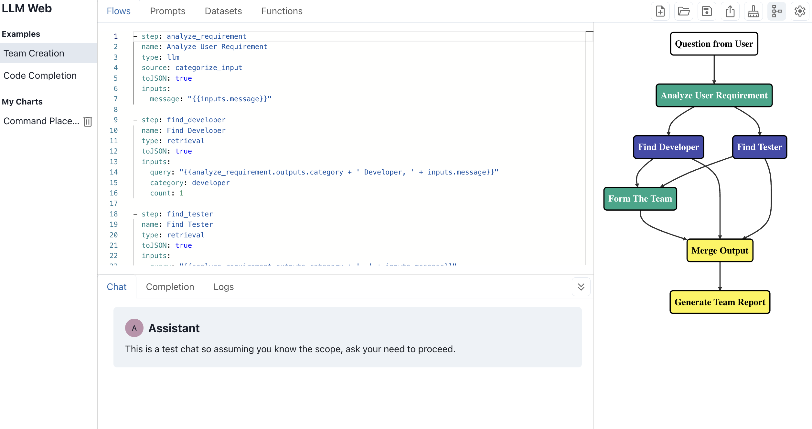

# LLM Web
[llmweb.ai](https://llmweb.ai/) - a LLM flow design tool all in web.

## Features
- Start design your LLM flow with 0 installation and no API cost.
- Design and save your spike in one YAML chart, export and share.
- Playground with chat and monaco editor.
- All in your browser, no security risk.
- Compatible with [WebLLM](https://webllm.mlc.ai/), GPT-4 and Gemini.

## Screenshot
